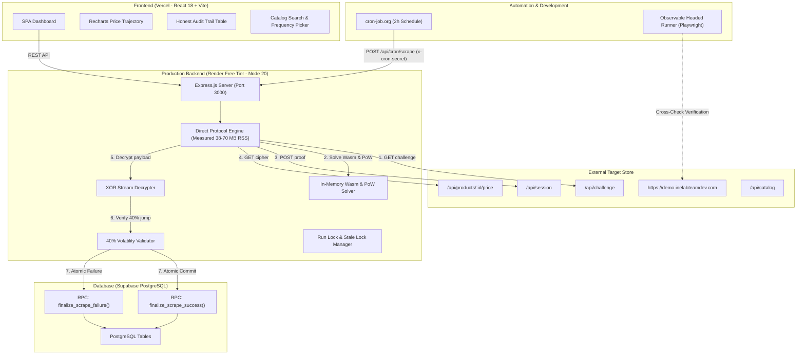

# Product Price Tracker

A resilient, full-stack price tracking and automated scraping web application built for the **INE Software Engineer Intern Assignment**.

The system tracks e-commerce products from `https://demo.inelabteamdev.com/`, executes automated background scraping on a fixed 2-hour schedule, visualizes price and stock history via interactive time-series charts, and maintains a 100% transparent audit log of all scrape outcomes.

---

## Architecture Overview



---

## Key Reliability Invariants & Amendments

1. **Zero Corrupted Data Guarantee (Assertion a)**:
   - Failed, placeholder (`g: 1`), stale, or unverified quotes are strictly **never** stored in `price_history`.
   - On failure, details are recorded exclusively in `scrape_log`.
2. **Atomic RPC Transactions (Amendment 2)**:
   - Direct `INSERT` on `price_history` is revoked in production.
   - All persistence occurs through atomic PostgreSQL functions (`finalize_scrape_success` and `finalize_scrape_failure`), guaranteeing that history inserts, log updates, and schedule advancements commit in a single transaction.
3. **40% Volatility Jump Confirmation (Amendment 3)**:
   - If a newly scraped price diverges by $\ge 40\%$ from the last recorded price, the engine executes an immediate confirmation re-fetch.
   - Two agreeing fetches ($\le 5\%$ divergence): stored and flagged (`flagged = true`).
   - Disagreeing fetches: classified as `VALIDATION_FAILED`, 0 rows in `price_history`.
4. **Resilient Protocol Handshake (Amendment 4)**:
   - Handshake rejections (HTTP 401/403) are classified as `STRUCTURE_CHANGED`. The scraper logs the event, generates an unresolved alert in the database, stores nothing, and halts retries.
5. **Deterministic Offline Test Suite (Amendment 5)**:
   - All 68 automated tests run 100% offline using an injected `FakeDatabase` layer, requiring zero external network or Supabase credentials.
6. **Dynamic Currency Normalization (Amendment 6)**:
   - Currency is parsed dynamically from decrypted quotes (`quote.c`, e.g. `"INR"`), never hardcoded.
7. **Production Memory Safety (Measured 38–70 MB RSS)**:
   - Pure Node.js Direct Protocol Client runs without headless browsers. Measured baseline RSS is ~24 MB, peaking at ~38–70 MB during Wasm compilation and network fetch (measured via `process.memoryUsage().rss`). This provides > 440 MB headroom on Render's 512 MB free tier limit. Scrape latency is about 150–250 ms warm, up to about 9 s cold when encountering backoff retries or initial uncompiled Wasm JIT. Wasm modules are cached in-memory for the process lifetime.
8. **Automated Alert Generation**:
   - All 4 alert types (`structure_changed`, `price_drop`, `back_in_stock`, and `scrape_failing` after 3 consecutive failures) are handled directly in the atomic PostgreSQL RPC layer and rendered in the frontend banner.

---

## Quickstart (Local Development)

### 1. Prerequisites
- **Node.js**: `>= 20.0.0`
- **npm**: `>= 10.0.0`

### 2. Backend Setup
```bash
cd backend
npm install
npm test
npm run dev
```
Backend starts on `http://localhost:3000`. If no Supabase credentials are provided in `.env`, it automatically boots with the in-memory fake database.

### 3. Frontend Setup
```bash
cd frontend
npm install
npm run dev
```
Frontend starts on `http://localhost:5173`.

---

## Automated Test Suite

Run the full suite of **72 tests across 20 suites**:
```bash
cd backend
npm test
```
To run tests by category:
```bash
npm run test:unit          # Unit tests: Parser, Validator, Retry, Classifier
npm run test:integration   # Integration tests: Scraper faults, Atomic RPC, Alerts, Express API
npm run test:e2e           # Automated end-to-end browser audit (Playwright against FakeDatabase)
```

---

## CLI Tools

### Single Scrape CLI (`npm run scrape:once`)
Execute a single production scrape for any product:
```bash
cd backend

# Dry run (no database writes)
npm run scrape:once -- --product 125 --dry-run

# Scrape and persist to DB
npm run scrape:once -- --product 125
```

### Real Supabase Smoke Verification (`npm run smoke:db`)
Runs live atomic invariant verification against the Supabase database specified in `backend/.env`:
```bash
cd backend
npm run smoke:db
```

### Headed Observable Scraper with Playwright (`npm run scrape:headed`)
Launches a visible Chromium browser, bypasses cookie banners, simulates human cursor trajectories with 1.2s dwell times, intercepts the cryptographic handshake, extracts the DOM price, and cross-checks against the direct protocol:
```bash
cd backend

# Run headed observation
npm run scrape:headed -- --product 125 --dry-run

# Run with injected 503 fault to showcase retry handling
npm run scrape:headed -- --product 125 --dry-run --inject-fault=error

# Run with simulated network latency
npm run scrape:headed -- --product 125 --dry-run --inject-fault=slow
```

---

## Environment Variables Reference

### Backend (`backend/.env`)

| Variable | Required in Production | Default / Example | Purpose |
|---|---|---|---|
| `PORT` | No | `3000` | HTTP port to listen on (binds `0.0.0.0`) |
| `NODE_ENV` | Yes | `development` | Environment mode (`development`, `production`, `test`) |
| `SUPABASE_URL` | Yes (in prod) | `https://<ref>.supabase.co` | Supabase PostgreSQL project URL |
| `SUPABASE_SERVICE_ROLE_KEY` | Yes (in prod) | `<service-role-secret>` | Supabase secret key for atomic RPC calls |
| `CRON_SECRET` | Yes (in prod) | `local-dev-cron-secret` | Shared secret for `x-cron-secret` header |
| `FRONTEND_ORIGIN` | No | `http://localhost:5173` | Allowed CORS origin (Vercel URL in prod) |
| `STORE_BASE_URL` | No | `https://demo.inelabteamdev.com` | Target store URL |
| `SCRAPE_CONCURRENCY` | No | `2` | Max concurrent scrapes (can set to `1` on low-CPU instances) |
| `SCRAPE_TIMEOUT_MS` | No | `15000` | AbortController request timeout (15s default for cold starts) |

### Frontend (`frontend/.env`)

| Variable | Required in Production | Default / Example | Purpose |
|---|---|---|---|
| `VITE_API_URL` | Yes | `http://localhost:3000` | Backend API URL (Render URL in prod) |

---

## Production Deployment Blueprint

See [`docs/DEPLOY_CHECKLIST.md`](docs/DEPLOY_CHECKLIST.md) for full step-by-step instructions.

1. **Supabase**: Execute `supabase/schema.sql` in the Supabase SQL editor.
2. **Render**: Connect repository, set root to `backend`, build command `npm ci --omit=dev`, start command `npm start`. Add backend env vars.
3. **Vercel**: Connect repository, set root to `frontend`, set `VITE_API_URL`.
4. **cron-job.org**: Schedule `POST https://<backend>.onrender.com/api/cron/scrape` every 2 hours (`0 */2 * * *`) with header `x-cron-secret: <CRON_SECRET>`.

---

## Documentation Index

- [`docs/CODE_TOUR.md`](docs/CODE_TOUR.md) — Comprehensive architectural and code walkthrough.
- [`docs/PROTOCOL_EXPLAINED.md`](docs/PROTOCOL_EXPLAINED.md) — Reverse-engineering and cryptographic protocol analysis.
- [`docs/DESIGN_NOTE.md`](docs/DESIGN_NOTE.md) — Architecture decisions, volatility derivation, known limitations.
- [`docs/LOCAL_VERIFY.md`](docs/LOCAL_VERIFY.md) — Local testing and curl commands.
- [`docs/DEPLOY_CHECKLIST.md`](docs/DEPLOY_CHECKLIST.md) — Production deployment instructions.
- [`docs/RECORDING_SCRIPT.md`](docs/RECORDING_SCRIPT.md) — 2–4 minute video presentation script.
- [`docs/AI_MISTAKES_LOG.md`](docs/AI_MISTAKES_LOG.md) — Defect log and remediation history.
