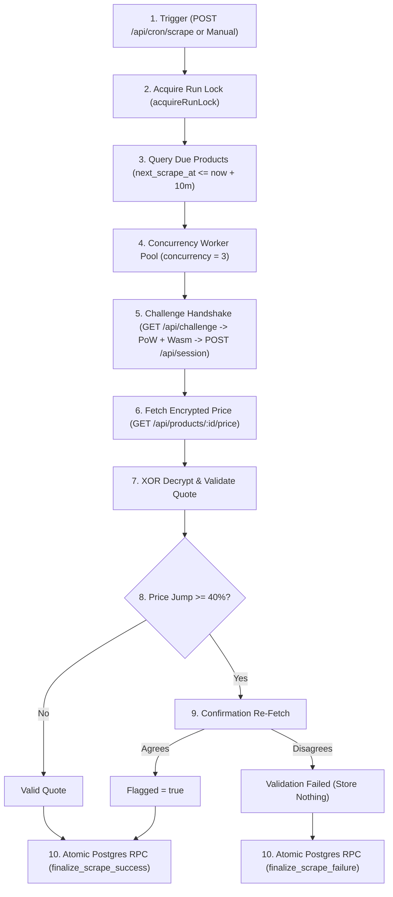

# Code Tour: Product Price Tracker Architecture

This document provides a technical walkthrough of the codebase, its directory structure, critical modules, and the complete end-to-end lifecycle of a scrape operation.

---

## 1. Directory Structure

```text
├── .github/
│   └── workflows/
│       └── ci.yml                 # Automated GitHub Actions test & build pipeline
├── backend/
│   ├── src/
│   │   ├── app.js                 # Express application factory with security & routing
│   │   ├── server.js              # Production server bootstrap, DB init, graceful shutdown
│   │   ├── config.js              # Zod environment variable parsing & validation
│   │   ├── cli/
│   │   │   ├── scrape-once.js     # Single scrape runner CLI (--product <id> [--dry-run])
│   │   │   └── headed-scrape.js   # Visible Playwright runner with slowMo & fault injection
│   │   ├── db/
│   │   │   ├── supabase.js        # Production Supabase PostgreSQL client wrapper
│   │   │   └── fake-db.js         # Deterministic in-memory database mock for offline testing
│   │   ├── routes/
│   │   │   ├── health.js          # GET /health service heartbeat
│   │   │   ├── store.js           # GET /api/store/search cached catalog search
│   │   │   ├── products.js        # CRUD, time-series history, logs, manual scrape
│   │   │   ├── cron.js            # POST /api/cron/scrape with constant-time secret check
│   │   │   └── alerts.js          # GET /api/alerts & PATCH /api/alerts/:id/ack
│   │   ├── scraper/
│   │   │   ├── constants.js       # Timing, backoff caps, error taxonomy, attestation hashes
│   │   │   ├── classify-error.js  # Maps HTTP status & exceptions to error taxonomy
│   │   │   ├── retry.js           # Exponential backoff with jitter and retryability rules
│   │   │   ├── parser.js          # XOR decryption & JSON normalization (dynamic currency)
│   │   │   ├── validator.js       # Basic quote validation & 40% volatility jump check
│   │   │   ├── fetcher.js         # Cryptographic challenge handshake & price retrieval
│   │   │   ├── scrape-product.js  # Multi-attempt product scrape orchestrator
│   │   │   └── run-manager.js     # Run locking, stale lock expiry, async worker pool
│   │   └── services/
│   │       └── store-catalog.js   # In-memory cached catalog search (15-min TTL)
│   └── test/
│       ├── fixtures/              # Real store HTTP payloads, Wasm binaries, ciphers
│       ├── unit/                  # Unit tests (classifier, parser, validator, retry)
│       └── integration/           # Scraper fault injection & Express API tests
├── frontend/
│   ├── src/
│   │   ├── api.js                 # API client wrapper with Render cold-start detection
│   │   ├── App.jsx                # App root, routes, alerts provider, modal manager
│   │   ├── components/
│   │   │   ├── Navbar.jsx         # Header navigation, store link, alerts counter
│   │   │   ├── AlertsBanner.jsx   # Protocol change alert notifications with ack button
│   │   │   ├── StatusBadge.jsx    # Color-coded status badges (success, retried, failed)
│   │   │   ├── SearchTrackModal.jsx # Catalog search & frequency selector modal
│   │   │   └── ColdStartNotification.jsx # Render free tier wake-up notification
│   │   ├── pages/
│   │   │   ├── DashboardPage.jsx  # Aggregated metrics, filter bar, product table
│   │   │   └── ProductDetailPage.jsx # Recharts price trajectory, audit log table
│   │   └── utils/
│   │       └── formatters.js      # Currency (₹), relative time, duration formatters
│   ├── vercel.json                # SPA rewrite rules for Vercel
│   └── vite.config.js             # Vite configuration with React plugin
├── supabase/
│   └── schema.sql                 # PostgreSQL schema, indexes, RLS, and atomic RPC functions
└── docs/
    ├── PROTOCOL_EXPLAINED.md      # Detailed cryptographic reverse-engineering & breakdown
    ├── DESIGN_NOTE.md             # Architecture decisions, volatility rationale, limitations
    ├── AI_MISTAKES_LOG.md         # Genuine defect log and remediation history
    ├── LOCAL_VERIFY.md            # Commands for testing locally
    ├── DEPLOY_CHECKLIST.md        # Pre-flight deployment guide (Render, Vercel, Supabase)
    └── RECORDING_SCRIPT.md        # 2–4 minute video presentation script & shot list
```

---

## 2. Life of a Scrape: Step-by-Step Execution Trace

When a scheduled cron or manual scrape executes, it passes through 7 distinct lifecycle stages:



### Stage 1: Trigger & Security
A cron request arrives at `POST /api/cron/scrape`. `routes/cron.js` reads the `x-cron-secret` header and validates it using constant-time string comparison (`crypto.timingSafeEqual`) to prevent timing side-channel attacks. It returns `HTTP 202 Accepted` immediately so the external cron scheduler never times out.

### Stage 2: Concurrency & Run Locking
`scraper/run-manager.js` checks the `scrape_runs` table for active runs. If a run has been running for $> 10\text{ minutes}$, it is marked as `failed` (stale lock expiration). If an active run is currently executing, the new trigger is skipped gracefully without crashing.

### Stage 3: Scheduling Due Check (Amendment 1)
Per Amendment 1, products are queried where `is_active = true` AND `next_scrape_at <= now() + 10 minutes`. This 10-minute anticipation window prevents scheduling drift caused by clock skew or worker queues.

### Stage 4: Cryptographic Challenge Handshake
`scraper/fetcher.js` executes the 4-step handshake:
1. `GET /api/challenge` $\to$ receives `salt`, `difficulty`, `csig`, and base64 WebAssembly binary.
2. Computes client attestation (`att`) with authentic Windows Chrome 124 canvas (`'b93ad65b96d012a5'`) and WebGL (`'bb3723445bc1f3b4'`) hashes, compiles and executes the Wasm module `exports.f(seed)`, and solves the SHA-256 proof-of-work.
3. `POST /api/session` $\to$ submits computed proof and receives an authenticated bearer token.
4. `GET /api/products/:id/price` $\to$ fetches raw XOR-encrypted price payload `{ e: "..." }`.

### Stage 5: Decryption & Parsing (Amendment 6)
`scraper/parser.js` derives the encryption key from `sha256("ine-mock-store-shared-k3y|enc|" + token)` and executes byte-wise XOR decryption. The resulting JSON payload is normalized, reading the dynamic currency code (`quote.c`, e.g. `"INR"`), price in cents, and stock quantity.

### Stage 6: Volatility Jump Confirmation (Amendment 3)
`scraper/validator.js` compares the new price with the most recent price in `price_history`. If the change is $\ge 40\%$:
- The scraper executes an immediate confirmation re-fetch.
- **Agreement** ($\le 5\%$ variance): stored in `price_history` with `flagged = true`.
- **Disagreement** ($> 5\%$ variance or re-fetch error): status marked `failed` with error `VALIDATION_FAILED`. **Zero rows are stored in `price_history`**.

### Stage 7: Atomic Database Transaction (Amendment 2)
Persistence is delegated to PostgreSQL stored procedures in `supabase/schema.sql`:
- `finalize_scrape_success(...)`: Updates the `scrape_log` record, inserts the new row into `price_history`, and advances `next_scrape_at = now() + interval` inside a single atomic transaction.
- `finalize_scrape_failure(...)`: Updates `scrape_log` with the exact error taxonomy and message, advances `next_scrape_at`, raises an alert if `structure_changed = true`, and strictly guarantees zero insertions into `price_history`.
