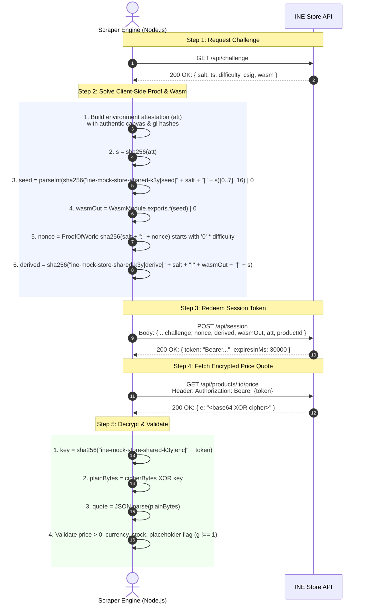

# Understanding the INE Store Scraping Protocol

This document provides a plain-English explanation of how `https://demo.inelabteamdev.com/` protects price and stock data, the exact challenge handshake sequence, and how our codebase reliably solves it. It is designed so you can explain and walk through every detail in an interview.

---

## 1. Why Scraping This Store is Awkward

When a standard browser or HTTP client requests a product page like `https://demo.inelabteamdev.com/product/125`:
1. **Empty Shell**: The initial HTML sent by the server is an empty 459-byte container (`<div id="root"></div>`).
2. **Decoupled Pricing**: The standard metadata API (`/api/product/125`) supplies product details (title, description, specs, reviews), but **deliberately omits price and stock**.
3. **Interactive Traps in the DOM**:
   - The price starts hidden ("Price hidden") behind a disabled button.
   - The user interface demands user interaction: $\ge 8$ mouse movements with $\ge 40\text{ ms}$ intervals and $\ge 600\text{ ms}$ dwell time to unlock the button.
   - A `.cookie-overlay` banner blocks click events.
   - Fake decoy prices are rendered in `<span class="price-value" aria-hidden="true" style="display:none">` and `<span class="amount" data-price="true" ...>`. If a scraper inspects `[data-price="true"]`, it gets tricked.
   - Zero-width spaces (`\u200B`) are injected between digits, and numbers are rendered with arbitrary formatting (fullwidth unicode, comma decimals, etc.).
4. **The Underlying Transport**:
   - Instead of scraping the messy DOM, inspecting network traffic reveals that the client initiates a **cryptographic challenge handshake** with the backend server to fetch the raw, un-corrupted price and stock.

---

## 2. Handshake Sequence Diagram



---

## 3. Detailed Step-by-Step Breakdown

### Step 1: Request Challenge (`GET /api/challenge`)
The store issues a challenge package containing:
- `salt`: A 32-character random hex string unique to this session.
- `difficulty`: Number of leading zeroes required for the proof-of-work (typically 3).
- `ts`: Timestamp generated by the server.
- `csig`: Cryptographic signature binding the salt, timestamp, and challenge parameters.
- `wasm`: A base64-encoded WebAssembly binary.

### Step 2: Solve Client-Side Computation
1. **Attestation (`att`)**: The store expects a JSON object detailing the client environment. The server checks the canvas hash (`'b93ad65b96d012a5'`), WebGL driver hash (`'bb3723445bc1f3b4'`), hardware concurrency, screen dimensions, frame render intervals, and interaction state (`trusted: true`, dwell time $\ge 600\text{ ms}$, $\ge 8$ cursor moves).
2. **Seed Calculation**: We take the SHA-256 hash of `att` ($s$) and combine it with the salt and secret key (`ine-mock-store-shared-k3y`):
   $$\text{seed} = \text{parseInt}(\text{sha256}(\text{"ine-mock-store-shared-k3y|seed|" } + \text{salt} + \text{"|"} + s)\text{.slice}(0, 8), 16) \mid 0$$
3. **WebAssembly Execution**: The base64 Wasm module is compiled in memory using `WebAssembly.compile` and instantiated. We call its exported function `f(seed)` to obtain `wasmOut`.
4. **Proof of Work (`nonce`)**: We increment an integer counter starting at 0 until:
   $$\text{sha256}(\text{salt} + \text{":"} + \text{nonce})\text{.slice}(0, \text{difficulty}) = \text{"0"}^{\text{difficulty}}$$
   At difficulty 3, this takes ~1,000 to 10,000 iterations (under $5\text{ ms}$ in Node).
5. **Key Derivation (`derived`)**:
   $$\text{derived} = \text{sha256}(\text{"ine-mock-store-shared-k3y|derive|" } + \text{salt} + \text{"|"} + \text{wasmOut} + \text{"|"} + s)$$

### Step 3: Redeem Session Token (`POST /api/session`)
We send the complete bundle back to the server:
- `salt`, `ts`, `difficulty`, `csig`, `wasm` (the server parameters)
- `nonce`, `derived`, `wasmOut`, `att`, `productId` (the client's proof)

The server verifies the signature, attestation, proof of work, and derived hash. Upon success, it issues a signed JWT-like bearer token:
```json
{
  "token": "R0VUfC9hcGkvcHJvZHVjdHMvMTI1L3ByaWNlfDEyNXw1NzZjYjgwZDI3Yjg4MzJjZDFkM2FkMTJ8MTc4OTgxMDcyNzA0MQ...",
  "expiresInMs": 30000
}
```

### Step 4: Fetch Encrypted Price (`GET /api/products/:id/price`)
We send an authorized GET request with header `Authorization: Bearer <token>`.
The server returns:
```json
{
  "e": "oYy6l6L4pI+3hYyF/8..."
}
```

### Step 5: Decrypt Payload
The server encrypts the payload using XOR with repeated bytes of `sha256("ine-mock-store-shared-k3y|enc|" + token)`.
Decryption yields:
```json
{
  "p": 1475,
  "m": 1695,
  "n": 1585,
  "b": 8,
  "s": 0,
  "c": "INR",
  "t": 1789810868901,
  "r": 3.5,
  "rc": 25011,
  "sl": "Cobblestone Supply",
  "dd": 6,
  "v": "triple",
  "g": 0,
  "x": 1
}
```
- `p`: Current displayed price in major units (1475 -> ₹1,475.00 -> 147,500 cents).
- `s`: Stock quantity (`0` means Out of stock, `> 0` means In stock).
- `c`: Currency code (`"INR"`).
- `g`: Pending flag (`g === 1` means stale or updating, classified as `PLACEHOLDER_CONTENT`).
- `m`, `n`, `b`: MRP, sale deal price, badge % discount.

---

## 4. How the Codebase Handles Edge Cases

| Scenario | Code Handler | Behavior |
|---|---|---|
| **Expired / Invalid Token** | `fetcher.js` | Automatically discards stale token, requests fresh `/api/challenge`, and retries. |
| **Transient 503 / 500** | `classify-error.js` + `retry.js` | Classifies as `HTTP_5XX`, retries with exponential backoff (1s, 2s, 4s) + jitter. |
| **Rate Limited (429)** | `retry.js` | Extracts `Retry-After` header if present, pauses accordingly, and retries. |
| **Placeholder / Stale (`g: 1`)** | `validator.js` | Flags as `PLACEHOLDER_CONTENT`, triggers retry. Never stored as valid price. |
| **$\ge 40\%$ Volatility Jump** | `validator.js` | Executes immediate re-fetch. If agreement: marks `flagged = true`. If divergence: fails with `VALIDATION_FAILED`. |
| **Store Layout Changed** | `validator.js` | Flags `STRUCTURE_CHANGED`, logs failure, generates alert in DB, stores no price data. |
| **Render 512MB RAM Budget** | Scraper Architecture | Pure Node.js direct protocol uses $< 20\text{ MB}$ RAM, avoiding headless browser crashes. |
| **Auditing & Traceability** | `scrape-product.js` | Every run writes to `scrape_log` via `try/finally`. Atomic DB transaction guarantees log is recorded. |
